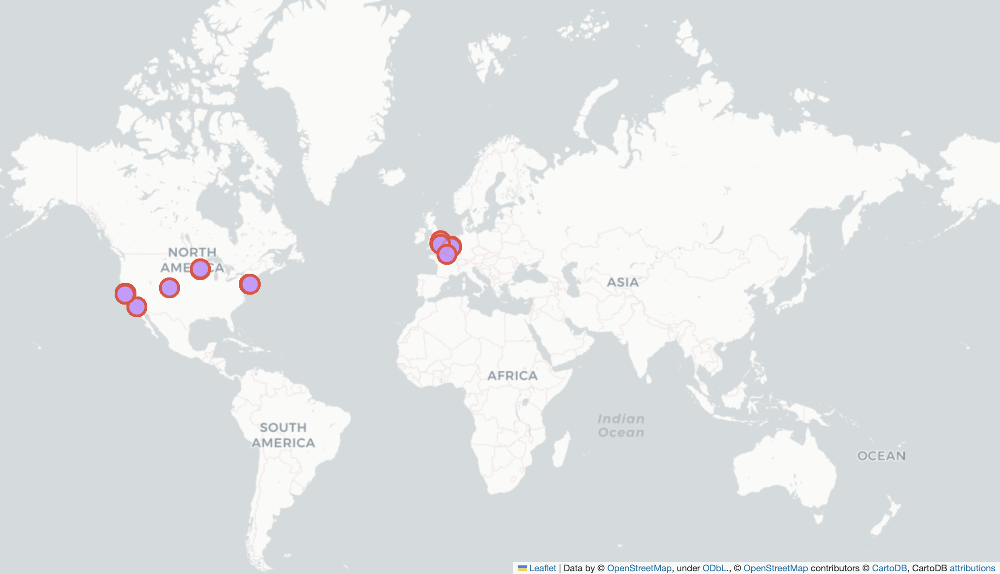

### A NEW BUSINESS - DA project-3

The goal of the project is to locate a new office for the creation of a company related to the video game industry.

There are a series of conditions to select the location of the office:

- Designers like to go to design talks and share knowledge. There must be some nearby companies that also do design.
- 30% of the company staff have at least 1 child.
- Developers like to be near successful tech startups that have raised at least 1 Million dollars.
- Executives like Starbucks A LOT. Ensure there's a starbucks not too far.
- Account managers need to travel a lot.
- Everyone in the company is between 25 and 40, give them some place to go party.
- The CEO is vegan.
- If you want to make the maintenance guy happy, a basketball stadium must be around 10 Km.
- The office dog-"Dobby" needs a hairdresser every month. Ensure there's one not too far away.

#### APPROACH

We have a data collection called Companies that will allow us to analyze the following conditions 
the following conditions:

- Environments where there are programmer companies and there are startups that have invoiced more than $1M.

After analyzing the data, we will obtain a series of candidate locations where to locate our office. 

A data summary is made to visualize which location meets the maximum requirements established. The summary is presented in pivot table format.

The distance radius applied to analyze the existing services has been 2500 m.

### Conclusion

Finally, we have **selected a company, Idea Shower, located in Minneapolis, USA**, which meets most of the conditions. 

The following constraints are discarded:

- Vegan restaurant for the CEO, given that multiple restaurants include this type of food in their menu without being specifically vegan.

- Developer companies, given that in the digital environment they can connect with their peers without any problem.

**Note:** the airport is 10 min away by car, but it does not appear on the maps since a radius of 2500 m distance has been applied.

PPT: https://www.canva.com/design/DAFw-RhzjpA/ZBKeXK1tjffpMaPkbn4ujw/edit